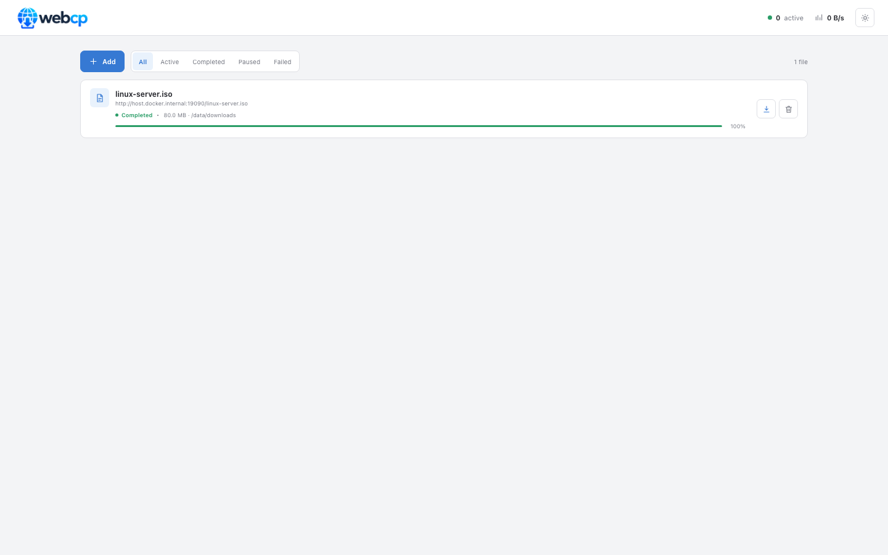
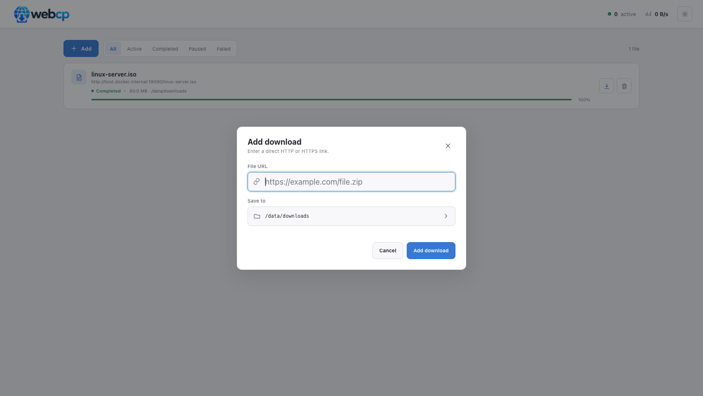
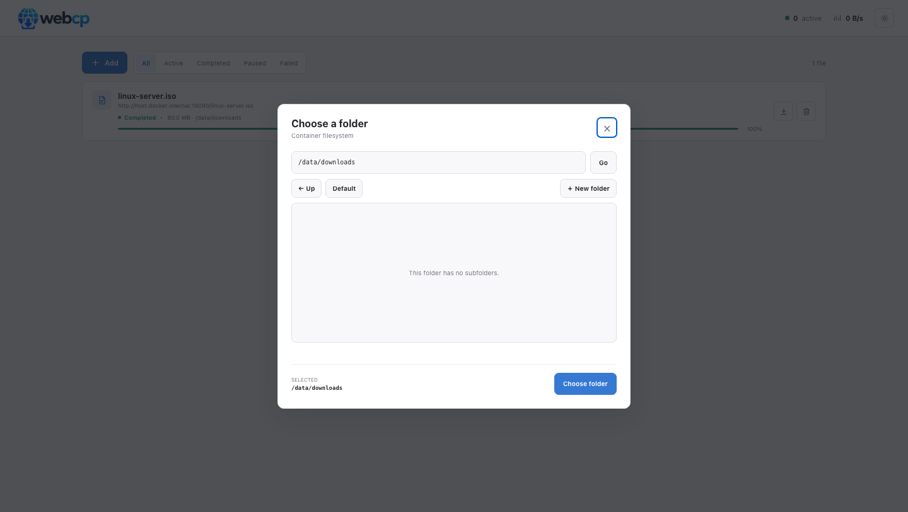

<p align="center">
  
</p>

<p align="center">
  A lightweight, self-hosted download manager for moving files from the web directly onto your server, NAS, or home lab storage.
</p>

webcp runs as a single Docker container. Paste an HTTP or HTTPS URL, choose any writable folder visible inside the container, and follow the transfer from a compact web interface. Downloads run on the server—not in the browser—so closing the tab does not interrupt them.

## Screenshots



<table>
  <tr>
    <td width="50%"></td>
    <td width="50%"></td>
  </tr>
  <tr>
    <td align="center">Add a URL and choose its destination</td>
    <td align="center">Browse or create folders inside the container</td>
  </tr>
</table>

## Features

- Multiple concurrent downloads with configurable concurrency
- Live progress, percentage, transferred size, filename, and combined speed
- Pause and byte-range resume support
- Automatic recovery of active downloads after an unexpected restart
- Collision-safe filenames and `Content-Disposition` filename detection
- Container filesystem browser with folder creation
- Per-download destination selection and configurable default path
- Delete jobs together with their downloaded or partial files
- Optional HTTP Basic authentication using environment variables or a mounted credentials file
- Persistent queue metadata and downloaded files
- Responsive light and dark interface
- Unprivileged container process and built-in health check
- Multi-platform GitHub Container Registry builds for AMD64 and ARM64

## Quick start

### Docker Compose

Clone the repository and start webcp:

```sh
docker compose up -d --build
```

Open <http://localhost:8080>. The included Compose file stores downloads and queue state in the `webcp-data` Docker volume.

### Prebuilt GitHub image

After publishing this repository to GitHub, its workflow produces an image at `ghcr.io/<owner>/<repository>:latest`:

```sh
docker volume create webcp-data

docker run -d \
  --name webcp \
  --restart unless-stopped \
  -p 8080:8080 \
  -v webcp-data:/data \
  ghcr.io/<owner>/<repository>:latest
```

Replace `<owner>/<repository>` with the lowercase GitHub repository path. Depending on the package visibility, you may need to run `docker login ghcr.io` before pulling it.

## Storage and destinations

`/data/downloads` is the default destination. The Save to picker can browse any directory visible and readable by the container, and it can create a new folder beneath the current location. A directory must be writable before webcp accepts it as a download destination.

Mount additional host paths or Docker volumes wherever you want them to appear:

```yaml
services:
  webcp:
    image: ghcr.io/<owner>/<repository>:latest
    ports:
      - "8080:8080"
    environment:
      DOWNLOAD_DIR: /storage/media
    volumes:
      - webcp-data:/data
      - /srv/media:/storage/media
      - /srv/backups:/storage/backups

volumes:
  webcp-data:
```

The container runs as UID/GID `10001`. Bind-mounted directories must grant that user read permission for browsing and write permission for downloads and folder creation.

## Authentication

Authentication is disabled by default. Enable HTTP Basic authentication with environment variables:

```yaml
environment:
  AUTH_ENABLED: "true"
  AUTH_USER: admin
  AUTH_PASSWORD: change-me
```

For deployment, a read-only credentials file keeps the password out of the Compose environment:

```yaml
services:
  webcp:
    environment:
      AUTH_ENABLED: "true"
      AUTH_CREDENTIALS_FILE: /run/secrets/webcp-credentials
    volumes:
      - ./webcp.credentials:/run/secrets/webcp-credentials:ro
```

The simplest credentials file contains one line:

```text
admin:change-me
```

The following formats are also supported:

```text
username=admin
password=change-me
```

```json
{"username":"admin","password":"change-me"}
```

Credentials from `AUTH_CREDENTIALS_FILE` take precedence over `AUTH_USER` and `AUTH_PASSWORD`. webcp refuses to start if authentication is enabled without complete credentials. The `/healthz` endpoint remains public for container health checks.

Basic authentication only encodes credentials. Place webcp behind an HTTPS reverse proxy when it is accessible over an untrusted network.

## Configuration

| Variable | Default | Description |
| --- | --- | --- |
| `LISTEN_ADDR` | `:8080` | HTTP listen address |
| `DOWNLOAD_DIR` | `/data/downloads` | Default location shown by the folder picker |
| `STATE_FILE` | `/data/.webcp/downloads.json` | Persistent download metadata file |
| `MAX_CONCURRENT_DOWNLOADS` | `4` | Maximum number of simultaneous transfers |
| `AUTH_ENABLED` | `false` | Enable HTTP Basic authentication |
| `AUTH_USER` | empty | Username used without a credentials file |
| `AUTH_PASSWORD` | empty | Password used without a credentials file |
| `AUTH_CREDENTIALS_FILE` | empty | Mounted credentials file; overrides environment credentials |

## Pause, resume, and recovery

Partial data is kept at the selected final path. When resumed, webcp requests the remaining bytes using an HTTP `Range` header. If the remote server does not support ranges, webcp safely restarts the transfer instead of appending duplicate data.

Queue metadata is atomically persisted to `STATE_FILE`. Active jobs resume after an unexpected process or container restart. A graceful shutdown pauses active jobs, allowing them to be resumed from the interface later.

## GitHub Actions and GHCR

The workflow in `.github/workflows/container.yml` performs the following:

- Checks formatting and runs `go vet`
- Runs the complete Go test suite with the race detector
- Builds `linux/amd64` and `linux/arm64` images
- Builds pull requests without publishing
- Publishes branch, commit SHA, semantic-version, and `latest` tags to GHCR
- Generates a GitHub build-provenance attestation

A push to `main` publishes `main`, `sha-…`, and `latest`. Version tags publish semantic image tags:

```sh
git tag v1.0.0
git push origin v1.0.0
```

The workflow uses the repository-provided `GITHUB_TOKEN`; no custom registry secret is required. Ensure Actions has permission to create packages in the repository settings.

## Development

webcp uses only the Go standard library, and its HTML, CSS, JavaScript, and logo are embedded into the compiled binary.

```sh
go test ./...
go run ./cmd/webcp
```

Use local writable paths when `/data` is unavailable:

```sh
DOWNLOAD_DIR=./data/downloads \
STATE_FILE=./data/state.json \
go run ./cmd/webcp
```

Build the production image locally:

```sh
docker build -t webcp .
```

The Docker build runs the standard test suite. GitHub Actions additionally runs tests with the race detector before publishing an image.

## Security notes

- Enable authentication before exposing the service beyond a trusted network.
- Use HTTPS at the reverse proxy so Basic Auth credentials are encrypted in transit.
- The filesystem API intentionally exposes readable container directories to authenticated users.
- Only mount host paths that webcp should be allowed to browse or write.
- Download URLs are fetched by the server, so treat access to the application as trusted server access.
